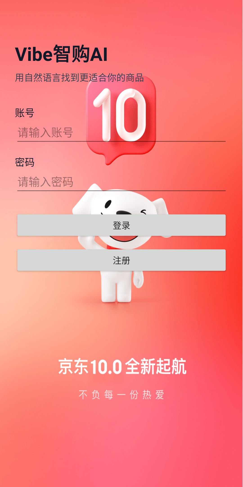
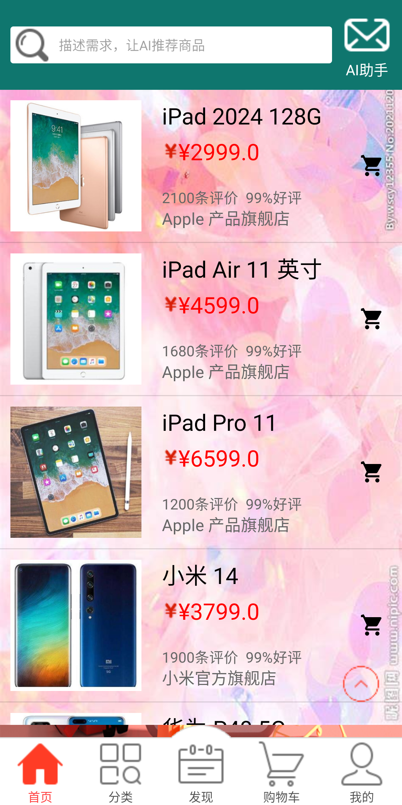
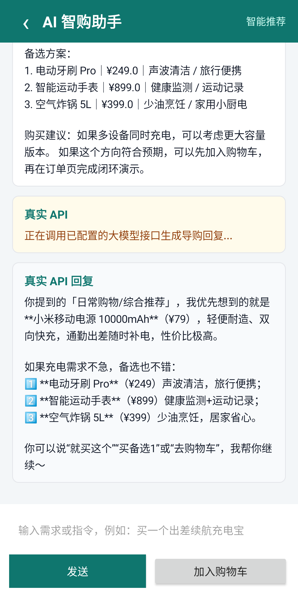
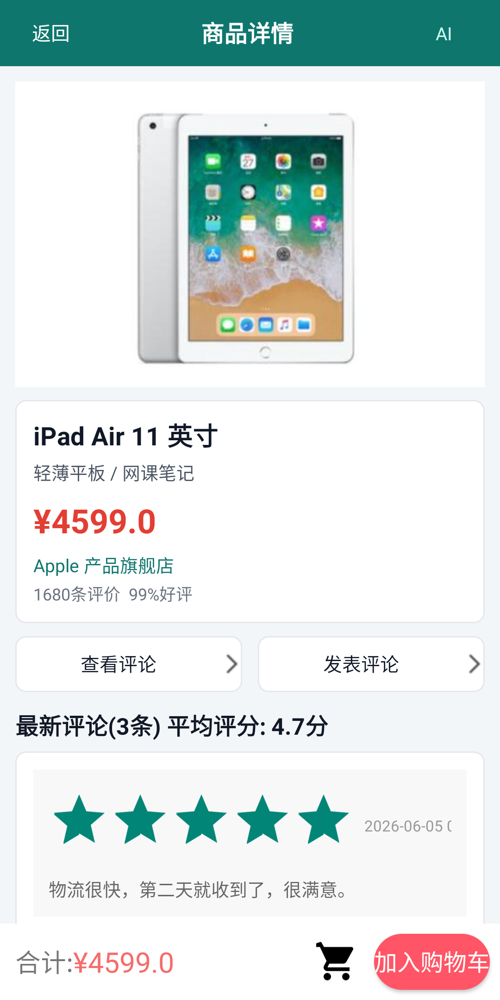
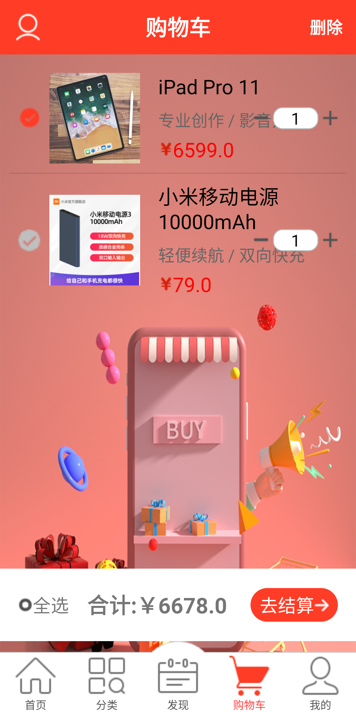
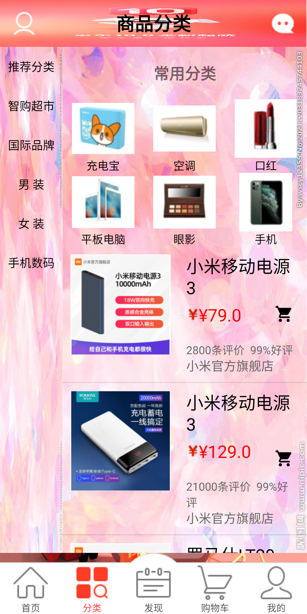
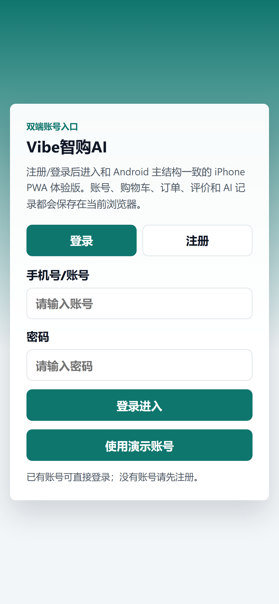

# Vibe智购AI - Android AI Shopping Assistant

> 一个基于 Android 的 AI 辅助购物 Demo，展示电商基础流程和 AI 推荐助手结合

[](android/shixun)
[](web-pwa)
[](https://www.java.com/)

## 项目简介

这是一个将 AI 助手融入购物流程的 Android 商城应用。用户可以通过传统的浏览、搜索方式购物，也可以用自然语言告诉 AI 助手购物需求（如"我想买一台适合学习的平板，预算3000左右"），AI 会解析需求并推荐合适的商品。

项目包含电商基础功能：登录注册、商品浏览、购物车、下单、订单管理等。同时提供了 PWA 版本，支持在 iPhone、Android 和桌面浏览器上直接访问。

本项目用于学习和求职展示，不是商业级产品。

## 功能截图

### Android App 版本

<table>
  <tr>
    <td><br><sub>登录注册</sub></td>
    <td><br><sub>商品浏览</sub></td>
    <td><br><sub>AI购物助手</sub></td>
  </tr>
  <tr>
    <td><br><sub>商品详情</sub></td>
    <td><br><sub>购物车</sub></td>
    <td><br><sub>订单管理</sub></td>
  </tr>
</table>

### PWA 版本（iPhone/浏览器）

<table>
  <tr>
    <td><br><sub>iPhone Safari 中访问</sub></td>
    <td><br><sub>添加到主屏幕后使用</sub></td>
    <td><br><sub>商品浏览</sub></td>
  </tr>
</table>

> 💡 **PWA 使用说明**：在 Safari 或 Chrome 中打开 PWA 版本，点击"添加到主屏幕"即可像原生 App 一样使用，无需 App Store 下载。

## 核心功能

### 电商基础功能
- ✅ **用户系统**：注册、登录（本地 SQLite 存储）
- ✅ **商品浏览**：分类导航、商品列表、搜索
- ✅ **商品详情**：查看商品信息、价格、评价
- ✅ **购物车**：添加商品、修改数量、删除、结算
- ✅ **订单管理**：下单、订单列表、订单状态跟踪（待付款/待收货/待评价）
- ✅ **评价系统**：查看商品评价、发表评价

### AI 购物助手
- ✅ **自然语言输入**：用户用日常语言描述购物需求
- ✅ **意图识别**：解析预算、用途、品类、偏好等关键信息
- ✅ **智能推荐**：基于用户需求匹配商品数据库
- ✅ **推荐记录**：保存历史推荐，方便回顾和对比
- ✅ **一键加购**：从 AI 推荐直接加入购物车

### 多端支持
- 📱 **Android App**：原生应用体验
- 🌐 **PWA 版本**：支持 iPhone（Safari）、Android 浏览器、桌面浏览器
- 🔄 **规划中**：iOS 原生 App（SwiftUI）

## 技术栈

### Android 端
- **语言**：Java
- **UI 框架**：XML Layout、AndroidX、Material Design
- **架构**：Activity + Fragment
- **列表优化**：RecyclerView
- **本地存储**：SQLite（用户、购物车、订单）
- **网络请求**：OkHttp
- **数据解析**：JSON（org.json）
- **AI 集成**：DeepSeek / OpenAI 兼容 Chat Completions API

### PWA 端
- **前端**：HTML5、CSS3、原生 JavaScript（无框架依赖）
- **PWA 特性**：Service Worker（离线缓存）、Web App Manifest
- **响应式设计**：适配移动端和桌面端

### 工程化
- **构建工具**：Gradle
- **版本控制**：Git + GitHub
- **配置隔离**：local.properties 管理 API Key

## AI 功能说明

### 工作流程

1. **用户输入需求**
   ```
   示例："我想买一台适合学习和看网课的平板，预算3000左右"
   ```

2. **意图解析**（`AiIntentParser`）
   - 提取关键信息：品类（平板）、用途（学习、网课）、预算（3000）

3. **本地商品匹配**（`RecommendationEngine`）
   - 根据品类、价格区间筛选商品
   - 按标签、销量、评分打分排序

4. **大模型增强**（`AiRemoteAdvisor`，可选）
   - 如果配置了 API Key，调用大模型生成更自然的推荐说明
   - 如果没有配置，使用本地规则生成推荐理由

5. **返回推荐结果**
   - 主推商品 + 备选方案
   - 推荐理由
   - 一键加入购物车

### 技术实现

- **端侧推荐兜底**：即使没有网络或 API Key，也能完成基本的商品推荐
- **API 调用**：支持 DeepSeek V4 等兼容 OpenAI Chat Completions 格式的 API
- **推荐记录**：所有推荐保存在本地 SQLite，用户可随时查看历史记录

## 演示路径

建议按以下步骤体验完整功能：

1. **注册登录** → 创建账号并登录
2. **浏览商品** → 查看首页推荐、分类商品
3. **AI 助手** → 输入购物需求，获取 AI 推荐
4. **加入购物车** → 从推荐或商品详情页加购
5. **下单** → 结算购物车，生成订单
6. **查看订单** → 订单列表，查看订单状态
7. **查看推荐记录** → 个人中心 → AI 推荐记录

## 项目结构

```
VibeAIMall/
├── android/shixun/                 # Android 原生项目
│   ├── app/
│   │   └── src/main/java/com/asyyy/shixun/
│   │       ├── ai/                 # AI 功能模块
│   │       │   ├── AiIntentParser.java          # 意图解析
│   │       │   ├── RecommendationEngine.java    # 推荐引擎
│   │       │   ├── AiRemoteAdvisor.java         # 大模型 API 调用
│   │       │   └── AiShoppingChatEngine.java    # 对话式购物
│   │       ├── cart/               # 购物车模块
│   │       ├── home/               # 首页模块
│   │       ├── user/               # 用户中心模块
│   │       └── AIAssistantActivity.java # AI 助手页面
│   ├── build.gradle
│   └── local.properties.example    # API Key 配置示例
├── web-pwa/                        # PWA 版本
│   ├── index.html
│   ├── app.js
│   ├── styles.css
│   └── manifest.webmanifest
├── docs/                           # 文档
│   ├── PROJECT_BRIEF.md            # 项目简介（中文）
│   ├── INTERVIEW_GUIDE.md          # 面试讲解指南
│   └── screenshots/                # 功能截图
└── README.md                       # 本文件
```

## 快速开始

### Android 端

#### 环境要求
- Android Studio Hedgehog (2023.1.1) 或更高版本
- JDK 11 或更高
- Android SDK API 30+

#### 运行步骤

1. **克隆仓库**
   ```bash
   git clone https://github.com/nai-he/VibeAIMall.git
   cd VibeAIMall
   ```

2. **配置 API Key**（可选）
   
   如果你想体验大模型增强的推荐功能：
   
   ```bash
   cd android/shixun
   cp local.properties.example local.properties
   ```
   
   编辑 `local.properties`，填入你的配置：
   ```properties
   sdk.dir=/path/to/your/android/sdk
   ai.api.key=your_api_key_here
   ai.api.baseUrl=https://api.deepseek.com
   ai.api.model=deepseek-v4-flash
   ```
   
   > ⚠️ **重要**：`local.properties` 已被 `.gitignore` 忽略，不会提交到 GitHub

3. **打开项目**
   
   使用 Android Studio 打开 `android/shixun` 目录

4. **同步 Gradle**
   
   点击 "Sync Project with Gradle Files"

5. **运行应用**
   
   连接 Android 设备或启动模拟器，点击 Run 按钮

### PWA 端

PWA 版本可以直接在浏览器中运行，无需编译。

#### 本地运行（推荐）
```bash
cd web-pwa
# 使用 Python 启动本地服务器
python -m http.server 8080
# 或使用 Node.js
npx http-server -p 8080
```

然后访问 `http://localhost:8080`

#### PWA 安装
- **桌面浏览器**：访问页面后，地址栏会出现"安装"图标
- **iPhone Safari**：点击分享按钮 → "添加到主屏幕"
- **Android Chrome**：点击浏览器菜单 → "添加到主屏幕"

## 安全说明

- **API Key 管理**：通过 `local.properties` 或环境变量配置，不提交到版本库
- **敏感文件忽略**：`.gitignore` 已配置忽略 `.idea/`、`build/`、`*.apk`、`*.jks` 等
- **本地存储**：用户数据、购物车、订单存储在本地 SQLite，未上传到服务器

## 当前限制

本项目是学习和展示用途的 Demo，存在以下限制：

1. **后端服务**
   - 当前使用本地模拟数据，没有真实的后端服务器
   - 用户数据、订单数据仅存储在本地设备

2. **商品数据**
   - 商品库是预设的模拟数据，不是实时抓取

3. **AI 推荐**
   - 以演示流程为主，不是完整的推荐算法系统
   - 推荐结果基于简单的规则匹配 + 大模型生成文案

4. **多端同步**
   - Android 和 PWA 是独立的，数据不互通

## 后续改进方向

如果继续开发，可以：

- 搭建后端服务（Spring Boot / Node.js），实现用户数据云端同步
- 接入真实商品库（爬虫或电商 API）
- 增强 AI 功能：用户画像、协同过滤、图像识别
- 开发 iOS 原生 App（SwiftUI）
- 使用 Kotlin Multiplatform 实现跨平台共享层
- 添加支付功能（沙箱环境）

## 面试讲解建议

### 30 秒项目介绍

"这是一个 Android 购物助手项目。除了传统电商的浏览、加购、下单功能，我加入了 AI 助手，用户可以用自然语言描述需求，AI 会解析意图并推荐商品。技术上，我用 Java 实现了商城业务流程，用 SQLite 管理本地数据，用 OkHttp 对接大模型 API。为了展示方便，还做了一个 PWA 版本，支持 iPhone 和浏览器访问。"

### 重点讲解内容

1. **AI 助手流程**
   - 用户输入 → 意图解析 → 商品匹配 → 推荐生成 → 加购
   - 本地规则兜底，API 增强体验

2. **技术选型理由**
   - 为什么用 Java 而不是 Kotlin：项目初期选型，后续可以考虑迁移
   - 为什么做 PWA：快速实现多端展示，降低体验门槛

3. **工程化实践**
   - API Key 配置隔离
   - .gitignore 管理
   - 代码结构分层

### 诚实回答可能的质疑

**Q: 这是推荐算法吗？**  
A: 不是完整的推荐系统。我实现的是基于规则的商品匹配，加上大模型生成推荐文案。真正的推荐算法需要用户行为数据、协同过滤、模型训练等，这是后续可以扩展的方向。

**Q: 有后端服务吗？**  
A: 当前版本没有。为了快速验证想法，我用本地 SQLite 存储数据。如果实际上线，需要搭建后端服务，实现用户管理、商品管理、订单管理等接口。

**Q: 项目最大的难点是什么？**  
A: 最大的挑战是把 AI 对话和商城业务打通。不能只是聊天，要让推荐结果能直接加入购物车，进入下单流程。我设计了一套状态管理，确保推荐记录、购物车、订单数据的一致性。

## 项目不足

- 没有网络请求的错误重试机制
- UI 设计比较基础，没有复杂的动画
- 没有单元测试和集成测试
- PWA 版本功能比 Android 版简化

## 联系方式

- **GitHub**：[nai-he](https://github.com/nai-he)
- **Email**：your-email@example.com
- **项目地址**：https://github.com/nai-he/VibeAIMall

## 许可证

本项目仅用于个人学习和求职展示，未经许可不得用于商业用途。

---

**⭐ 如果这个项目对你有帮助，欢迎 Star！**
